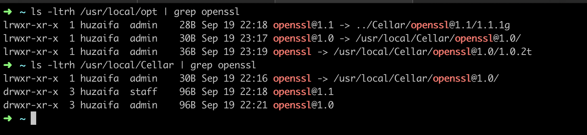

## Homebrew tap for openssl@1.0

1. `brew install openssl@1.1` (certain services like mysql@5.6 rely on openssl@1.1 therefore we need to install this too)
2. `brew install "huzaifaiftikhar/openssl/openssl@1.0"`
3. `ln -s /usr/local/Cellar/openssl@1.0/1.0.2t /usr/local/opt/openssl`
4. Check the installed directories, the symlinks should be as shown in the screenshot below

